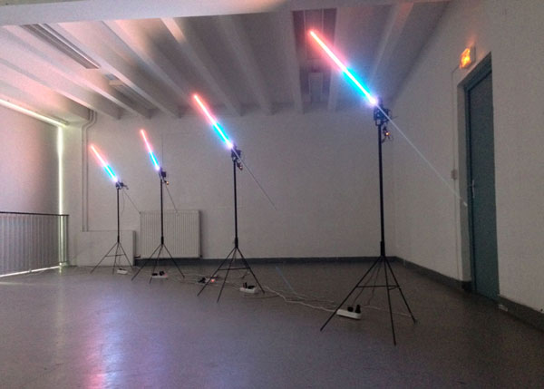

Rock around the clock
=====
Le projet **« Rock Around the Clock »** a été réalisé dans le cadre du Workshop de rentrée à l’ÉSAD Orléans, en octobre 2013, 
dirigé par François Brument. Il est constitué de :
- 4 dispositifs rotatifs (dont un *Master*) composés chacun de 
  - 1 moteur pas à pas (stepper motor)
  - 1 girlande de LEDs RGB (RGB Leds strip)
  - 1 arduino uno
  - 1 shield Ethernet
  - 1 driver pour le stepper motor
  - **[Master uniquement]** 1 driver pour l’appareil photo (USB) 
- 1 appareil photographique
  - il est relié avec une ralonge USB au *Master*
  - un appareil reflex de marque Canon (ou Nikon)
  - en option, un vidéo projecteur qui affiche en direct la dernière photographie
- 1 réseau local Ethernet
- 1 ordinateur controleur sous Processing
- pas mal de ralonges et d’alimentations électriques, cables Éthernet 

- projets de François Brument [in-flexions](http://in-flexions.com)
- [ESAD Orléans](http://esad-orleans.fr)
