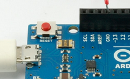
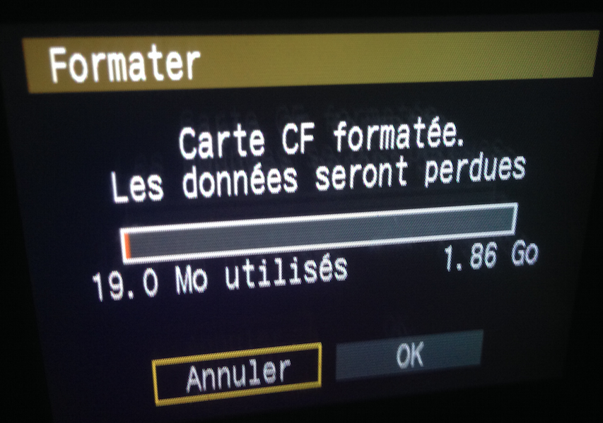

# Fiche technique : Rock Around The Clock

Ce projet est technique, et peut rapidement disfonctionner, il convient de ne pas paniquer ! en cas de problème, on peut l'arreter ou le laisser en stand-by Contacter le technicien référent, coordonées en partie 7.

## 1. Allumage 

- vérifier que toutes les rallonges electriques soient branchées, que les boutons des multiprises soient allumés
- allumer l'ordinateur si il ne l'est pas.
- vérifier que les 4 hélices affichent `une animation de lumière blanche`, et que les hélices ne tournent pas.
- si une des 4 hélices n'affichent pas `une animation de lumière blanche`, voir la procédure de redémarage d'une hélice 
- cliquer sur l'icone présente sur le bureau. 
- attendre l'ouverture de la fenetre éditeur **Processing** 
- cliquer sur le menu `Sketch > Present` ou bien le raccourci clavier `+⇧+c`
- la fenetre avec l'heure et les boutons de contrôle s'affichent en plein écran

## 2. Démarrage des cycles automatiques

- par défaut, au lancement du programme sur l'ordinateur, les hélices ne tournent pas. 
- vérifier le calibrage (3)
- appuyer sur le bouton `rouge` nommé `AUTORUN`  
- l'appereil photo se déclanche et fait un clic
- le video projecteur devient bleu
- les 4 moteurs se lancent 
- les lumière arrête leur boucle automatique et se mettent à dessiner les chiffres de l'heure.
- après un tour, les moteurs s'arrêtent
- l'appereil photo stop et refait un clic
- le vidéoprojetcteur affiche la photo qui vient d'être prise
- attente de 40 secondes avant redémarrage automatique du cycle

## 3. Arrêt des cycles automatiques

- il est **possible** d'arrêter les cycles à tout moment en appuyant sur le bouton `ÀUTORUN` `vert` il passe alors au rouge, et termine le cycle.
- il est **recommandé** d'appuyer sur le bouton `ÀUTORUN` `vert` pour arrêter uniquement quand les hélices ne tournent pas. 
- vous pouvez lancer un seul cycle en appuyant sur le bouton run. après un tour il s'arrete.

## 4. Calibrage

le calibrage est facultatif, il permet de corriger une rotation accidentelle de l’œuvre. En effet, les moteurs induisent, avec la durée, un rotation supplémentaire, qui amène une rotation non désirée des chiffres. 

- sur l'ordinateur, vérifiez que vous êtes bien en *pause* (le bouton `AUTORUN` doit être `rouge`) et que les hélices ne tournent pas. 
- chaque moteur a 2 boutons pour faire tourner à gauche (left) et à droite (right), il suffit de maintenir le bouton de la souris sur le bouton pour le faire tourner dans un sens ou un autre.
- ajustez la pale pour que la guirlande de leds soit à la verticale, en haut.
- appuyez sur le bouton `set` situé entre les boutons `left` et `right` pour valider la position de l'hélice.
- passez à l'hélice suivante. et opérez de la même manière.  

## 5. Procédure de redémarage d'une hélice. 

- vérifier que la carte est allumée. 
- appuyer sur le bouton poussoir `reset` de la carte Arduino. 
Les cartes électroniques arduino sont présentent sur chaque hélices. plusieurs cartes s'encastrent les unes sur les autres. La carte Arduino est celle qui est le plus à l'interieur, vers le moteur et les pâles. le bouton de `reset` est un petit bouton situé en bas à gauche (environ 3mm de diametre, rouge foncé) 
après avoir appuyé, l'hélice doit afficher `l'animation de led blanche`. 
  
- **si vous ne trouvez pas le bouton de reset**, il est possible de redémarrer simplement l'hélice en branchant débranchant/rebranchant le secteur. le seul risque est que le démarrage ne fonctionne pas, auquel cas, vous pouvez réessayer jusqu'à obtenir `l'animation de lumière blanche`. 

## 6. Diagnostiques et solutions

### 6.1 les leds ne s'allument pas sur une hélice

- tenter la procédure de redémarage d'une hélice. 
- ensuite, **si ça ne change pas au bout de 10 tentatives**, il se peut que le cable de commande des guirlandes de leds soit deconnecté, il faut rebrancher un fil vert et le mettre dans la fiche numérotée 5 de la carte la plus extérieure. 

### 6.2 les cartes électroniques ne s'allument pas

- aucun voyant lumineux ne s'allume sur les cartes electroniques sur les hélices. 
- tenter la procédure de redémarage d'une hélice.
- si cela ne suffit pas, débranchez et appelez le technicien. 

### 6.3 l'appareil ne semble plus prendre de photo

- mettez en pause en appuyant sur AUTORUN. 
- cliquer sur les boutons de test `START-BULB` et `STOP-BULB`, situés en bas à gauche de la fenetre, pour essayer de déclancher l'ouverture, puis la fermeture de l'appareil photo.
- si il ne se déclenche plus (on entend un clic) voir 6.5

### 6.4 les leds affichent une animation rouge

- les `led rouge chenillard lent` est un message d’alerte qui signifie que l'hélice `Master` (la seule connectée à l'appareil photo en USB) — la plus proche de l'ordinateur — a un problème de connection avec l'appareil photo.
- cela peut venir de plusieurs points :
	- l'appareil photo est bloqué ou hors service. voir la section 6.5
	- la connection USB entre l'hélice `Master` et l'appareil photo est mauvaise
	- le programme de l'hélice est bloqué
- redémarrez l’hélice master suivant la méthode 5.
- si cela ne fonctionne pas, vérifié la connection USB entre l'appareil et l'hélice. 
- si la connection semble correcte, testez la connection 6.3. 

### 6.5 l’appareil photo semble bloqué

voici quelques symptôme d'un appareil photo bloqué 

- l'appareil photo allume son voyant **rouge** sans arrêt pendant plus de 5 minutes, même quand les hélices ne tournent plus. 
- l’appareil photo ne se déclenche plus (on entend plus de clic au démarrage et à l'arret des rotations des hélices)
- la carte mémoire est pleine
- l'appareil n'affiche

quelques astuces rapides :
 
- débranchez le **cable video** (noir) de l'appareil photo.
- débranchez le **cable usb** (blanc) de l'appareil photo. 
- essayez d’appuyer sur le bouton `lecture` (bouton fleche triangulaire en bas à gauche) pour afficher la derniere photo. 
- essayez d’appuyez sur le bouton `menu` (bouton en haut à gauche)

### 6.6 vidange des photos et formatage de la carte mémoire

le dispositif prend une photo toutes les 100 secondes, soit presque 300 par 8 heures
la carte Compact Flash fait 2Gb, et elle se remplira au fur et à mesure. 
suivant mes calcules, elle se remplira en environ une semaine. 

#### 6.6.1 vérification de la capacité restante

- mettez en pause le dispositif.
- débranchez le **cable video** (noir) de l'appareil photo.
- appuyez sur le bouton `MENU` de l'appareil photo.
- trouvez le menu `FORMATER` de dans les réglages, à l'aide des deux molettes de l'appareil photo.
- appuyez une fois sur la touche `ENTER` (bouton au centre de la grosse molette centrale)
- une jauge apparait et indique la proportion de mémoire utilisée.
- si vous avez un Mac portable à disposition passez à l'étape 6.6.2
- si vous n’avez pas de Mac portable à disposition et que la jauge indique un taux de remplissage qui dépasse les 80%, passez à l'étape 6.6.3
- sinon, rebranchez les câbles et relancé le dispositif.

#### 6.6.2 vidange des photographies 

- après avoir vérifié les étapes 6.6.1
- débranchez le **câble USB** (blanc) de la rallonge usb au sol
- branchez ce **câble USB** à votre Mac Portable
- lancez l'utilitaire **Transfert d’images.** présent sur tous les Mac dans Applications. 
- cherchez le canon 40d
- selectionnez un dossier de transfert (par défaut `Mes Images`)
- appuyez sur le bouton `Tout importer` en bas à droite. 
- une fois l'import terminé, signalé votre import au contact technique afin qu'il récupère ces images.
- formatez la carte CF, voir 6.6.3
- rebranchez les câbles.
- redémarrez l’hélice `Master` (la plus proche de l'ordinateur) voir 5.
-  redémarrez le dispositif. 

#### 6.6.3 formatage de la carte

- après avoir vérifié les étapes 6.6.1

- **si la jauge dépasse les 80% d'utilisation** ou que **vous avez vidangé la carte**
- utilisez la molette pour selection OK, 
- validez avec le bouton `ENTER` au centre de la molette. 

	** ATTENTION CETTE OPÉRATION EST IRRÉVERSIBLE.** 
	
- rebranchez les câbles de l’appareil photo.
- redémarrez l’hélice `Master` (la plus proche de l'ordinateur, connectée en USB à l'appareil photo), voir 5.
- relancez le dispositif. 

### 6.7 le chiffre de droite est parfois mal formé

sur la photographie, c’est normal, car il est composé du chiffre des unités, des minutes,
avec un cycle de 60 secondes, il est souvent à cheval sur deux valeurs différentes, et forme donc un chiffre hybride.

### 6.8 autres problèmes

- appeler le technicien

## 7. contact technique ESAD Orléans

Arthur Violy 

avioly@esad-orleans.fr

06 88 01 42 24